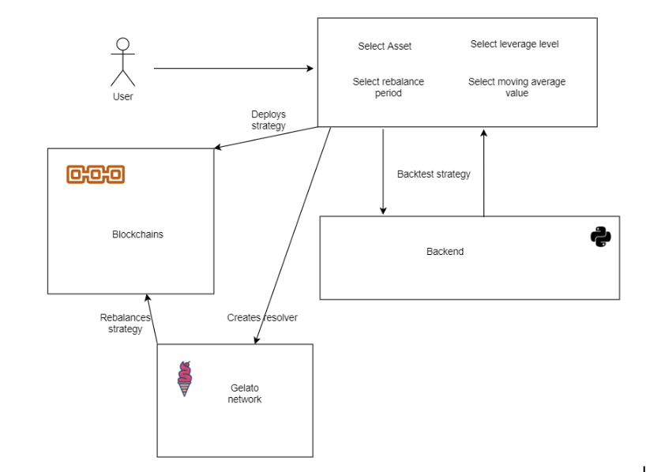
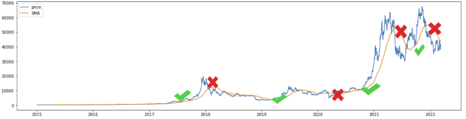
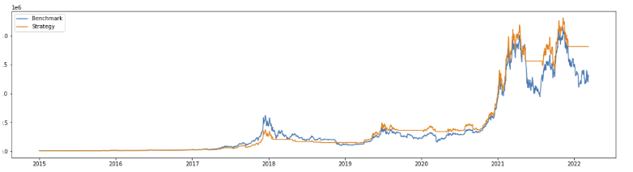

# <Your-Project-Title>

## Description

The main goal of this project is to create a decentralized infrastructure to allow traders to backtest and deploy their strategies in a decentralized and non custodial environment. 
The scope of this first project in the context of this hackathon will be to create this infrastructure with a simple trend following strategy where the user will be able to define and backtest the strategy and deploy it using smart contracts. 
To allow users to get a better return on investment, this strategy will be able to use leverage, using gearbox protocol, and the liquidity that is not being used at any moment of time could be deployed in Yearn finance, to earn yield in the assets that are not being deployed in the strategy. 

## Architecture

In order to create this infrastructure we have created several components.

* <ins>Python backend:</ins> Is responsible for calculating the backtest of the strategy with the parameters given. This backtest should return the return of the strategy, the return of the asset only if it would have been held, the return of the strategy and the return of the strategy using leverage and yearn finance yield.
* <ins>Smart contracts:</ins> Are responsible for deploying the user assets in the specific protocol that the strategy has defined, in some cases can be deposited in risky assets, in other cases in stable assets depending on the market conditions. 
* <ins>Resolver:</ins> Will be responsible for calling the smart contracts when the conditions established in the strategy are met. Should check the price of the assets in the frequency defined and if the conditions are met, call the rebalance function. We tried to create this resolver using Gelato and Polywrap but this version is not stable yet, so we used a simple nodejs to simulate this behaviour, the idea is to move this to a Gelato resolver.
* <ins>Frontend:</ins> Is responsible for giving the user the interface to create the strategy and backtest it, once the strategy is defined, can be deployed in the contracts using this interface. 

The following diagram describes the architecture
[


## Strategy
In order to test this infrastructure we are going to create one simple trend following strategy, where the asset selected will be buyed when the price is above the defined moving average and sold when it is traded below the moving average.
This moving average will give the trading signals that will be triggered by resolver and rebalancing the strategy when needed. As example this is a sample of bitcoin in a daily moving average of period 100. 

[

This creates a strategy that protects the downside and can outperform the hold strategy in the long term by avoiding big drawdowns. 

[

To amplify the results, the strategy will allow the trader to get leverage in their account to use the strategy using margin and when the asset is sold, will be deposited in a yearn's finance vault to get some yield on the stable coins while they are idle. 


## Installation

In order to install all the project it's needed

* <ins>Python backend:</ins> Run the project using the docker instructions in the Readme folder
* <ins>Smart contracts:</ins> Run `cd contracts && npm i`
* <ins>Resolver:</ins> Run `cd cron && npm i`
* <ins>Frontend:</ins> Run `cd fronted && npm i`

## Usage

1. Install ganache-cli: npm i ganache-cli
2. Create a kovan forked in localhost `ganache-cli --fork {KOVAN_RPC_ENDPOINT}`
3. Create a .env  file with this content
````
    KOVAN_URL= {KOVAN_RPC_ENDPOINT}
    PRIVATE_KEY={WALLET_PRIVATE_KEY}
````
4. Run the deploy script npm run deploy:local"
4. Run the docker container with the backtester
4. Run the frontend  `npm start`
5. Enjoy!


## Credits

This amazing project was created by:

* Fabrizio Giannitrapani @fabriziogianni7
* Ivan Alberquilla @ialberquilla
* Vasileios Georgopoulos @obasilakis


